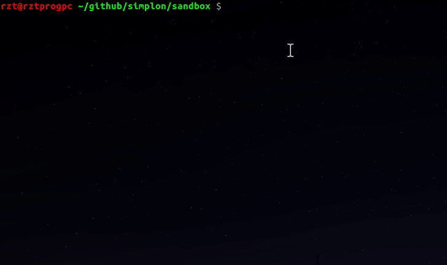

# Placeholder IMAGE Snippets for EMMET-Vim

Fastly image placeholder service snippet (From [placeholder.com](placeholder.com))



```
i:ph
```

## REQUIRED

* A Plugin manager
* [EMMET-VIM](https://vimawesome.com/plugin/emmet-vim)
* [WEBAPI-VIM](https://github.com/mattn/webapi-vim)

## SOURCES & HELPFUL DOCS

* https://docs.emmet.io/cheat-sheet/
* https://docs.emmet.io/customization/snippets/
* https://github.com/emmetio/emmet/blob/master/lib/snippets.json
* https://placeholder.com/

## THANKS TO

* mattn for "emmet-vim" & "webapi-vim"
* djefry for the logo

## LICENCE

MIT
